# Sha256CoreV1

## Architecture

`Sha256CoreV1` has no central finite state machine. There is no `ControlBox`
sequencing the stages — each stage runs its own local state machine and
advances purely on **local handshakes** with its neighbours: a stage tells
the stage after it "my output is ready", and pulls new input only once its
predecessor raises that signal. This makes the design a self-timed pipeline:
every block can be swapped, stalled or reused without touching a shared
controller.

```mermaid
flowchart LR
    IB([Input Bus\nInput / NBbytes]) --> IFB[Input Buffer\ntop-level Input,\nInput_ready ports]
    IFB -->|Input 512b| IF[InputFormatter]
    IF -->|output_inp_L1 512b\n+ L1_input_ready| L1[L1_Handler\nmessage schedule W0..W63]
    L1 -->|L1_to_buffer interface\nW0..W63 + DataReady\n+ L1_done| L1B[L1_res_Buffer]
    L1B -->|output_val 32b\n+ L2_start| L2[L2_Handler\ncompression rounds]
    L2 -.->|output_address 7b\naddresses W word| L1B
    L2 -->|output 256b\n+ output_ready| OB[Output Buffer\ntop-level output,\noutput_ready ports]
    OB -.->|output_consumed| L2
    OB --> OBUS([Output Bus])
```

### Stage-by-stage handshake

| Stage | Consumes | Produces | "I'm done" signal | Triggers |
|---|---|---|---|---|
| Input Bus → **Input Buffer** | `Input` (512b), `NBbytes` on the engine's top-level ports | the raw message word held on those ports | `Input_ready` (top-level, driven by whoever feeds the engine) | `InputFormatter` to start padding |
| **InputFormatter** | `Input`, `NBbytes` | `output_inp_L1` (512b padded block, `0x80` marker + length appended) | `L1_input_ready` (`preparationDone`) | `L1_Handler` to load the block |
| **L1_Handler** | `output_inp_L1`, `L1_input_ready` (`inputReady`) | the 64-word message schedule `W[0..63]`, expanded from the initial 16 words | `L1_done` and `DataReady` on the `L1_to_buffer` interface | `L1_res_Buffer` to latch the schedule |
| **L1_res_Buffer** | `L1_to_buffer` (`W0..W63`, `DataReady`) | `output_val` (32b), the word addressed by `output_address` | `L2_start` (`values_updated`) | `L2_Handler` to begin the compression loop |
| **L2_Handler** | `output_val` at the `output_address` it drives, `L2_start` | the 256-bit digest (`h0..h7` after 64 rounds) | `output_ready`, gated by the peer's `output_consumed` | **Output Buffer** to latch the digest |
| **Output Buffer** → Output Bus | `output`, `output_ready` on the engine's top-level ports | the finished digest presented on the output bus | `output_consumed` (fed back into `L2_Handler`) | the consumer downstream of the engine |

Notes:
- `output_address` actually flows **backwards**: `L2_Handler` drives it to pull
  one schedule word per round from `L1_res_Buffer`, so that link is a
  request/response pair rather than a one-way ready signal.
- "Input Buffer" and "Output Buffer" are not separate classes yet — they are
  the `Sha256CoreV1` top-level ports (`Input`/`Input_ready` and
  `output`/`output_ready`/`output_consumed`) that sit between the engine and
  whatever drives/consumes it on the bus.
- Because every stage only reacts to its own "ready" input, the pipeline can
  in principle have multiple blocks in flight at once (stage *n* starting on
  a new word while stage *n+1* is still finishing the previous one), even
  though `Sha256CoreV1` currently only exercises this in a purely sequential
  fashion.